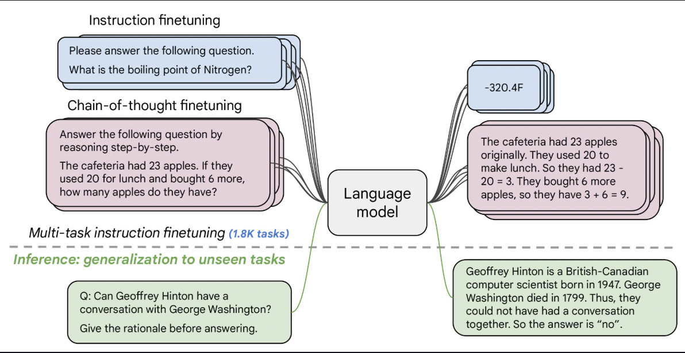

# FineTuning Google's FLAN-T5 model

The **T5 (Text-to-Text Transfer Transformer)** model is a powerful Transformer-based language model developed by Google. \
 
It stands out by framing all NLP tasks as text-to-text problems, meaning both input and output are text strings. This unified approach simplifies the process of applying the model to various tasks, including machine translation, question answering, and summarization. 


FLAN-T5 is just better at everything. For the same number of parameters, these models have been fine-tuned on more than 1000 additional tasks covering also more languages. 

Here the goal is to fine-tune this FLAN-T5 model on a specific area topics like physics, chemistry, and biology. \
The [SciQ](https://huggingface.co/datasets/allenai/sciq) dataset contains 13,679 crowdsourced science exam questions about Physics, Chemistry and Biology, among others. The questions are in multiple-choice format with 4 answer options each. For the majority of the questions, an additional paragraph with supporting evidence for the correct answer is provided.

## FineTune Approach
1. Get the tokenizer function and model from transformers module.
2. Add 'think' and 'answer' tokens ot the tokenizer.
3. Training the entire model with 77M params can easily result to Out-Of-Memory (OOM) error. So, we introduce **Low-Rank Adaptation (LoRA)** to train only a fraction of parameters. 
```sh
lora_config = LoraConfig(
    task_type="SEQ_2_SEQ_LM",
    r=2,
    target_modules=["q", "v"])

LoRA_model = get_peft_model(model, lora_config)
print(LoRA_model.print_trainable_parameters())

Output: trainable params: 86,016 || all params: 77,022,592 || trainable%: 0.1117
```
> **Note**: The target module can be changed to 'linear' or 'all' resulting change in the trainable params.
4. Restructure the data, tokenize it and conform it to [Dataset](https://huggingface.co/docs/datasets/en/tutorial) type.
5. Supervised training first and then improving the performance using Reinforcement learning methods.

